# MB1704 NANO CH340

 

 

## 概述

 NANO ch340的处理器核心是ATMEGA328P-AU。和官网的ARDUINO NANO对比， NANO ch340使用的USB转串口芯片为CH340G，安装的驱动文件不一样，其他的使用方法完全一样。

它同时具有14路数字输入/输出口（其中6路可作为PWM输出），8路模拟输入，1个16MHz晶体振荡器，1个Type-c USB口，1个ICSP接口和一个复位按钮。

其中ICSP接口是用来给ATMEGA328P-AU烧录固件，由于这个该芯片我们在出厂前都以烧录好固件，所以一般不用。使用时我们可以利用Type-c USB线供电，，还可以利用排母接口Vin GND（DC 7-12V）供电。

## 规格参数

1. 单片机：ATMEAG328P

2. 工作电压：5v

3. 输入电压（推荐）：DC 7- 12v

4. 数字I/0引脚：14 (DO-D13)

5. PWM数字I/0引脚：6 （D3 D5 D6 D9 D10 D11）

6. 模拟输入引脚：8（A0-A7）

7. 直流电流每I/0引脚：40 mA

8. Flash内存：32kb其中2kb由bootloadere使用

9. SRAM：2KB

10. KBEEPROM: 1KB

11. 时钟速度：16 MHz

12. LED_BUILTIN:D13
13. 工作温度：0℃-50℃
14. 开发板尺寸：18MM×45MM×18MM
15. 开发板重量：6.0G
16. 工作温度：0℃~50℃

## 产品接口说明

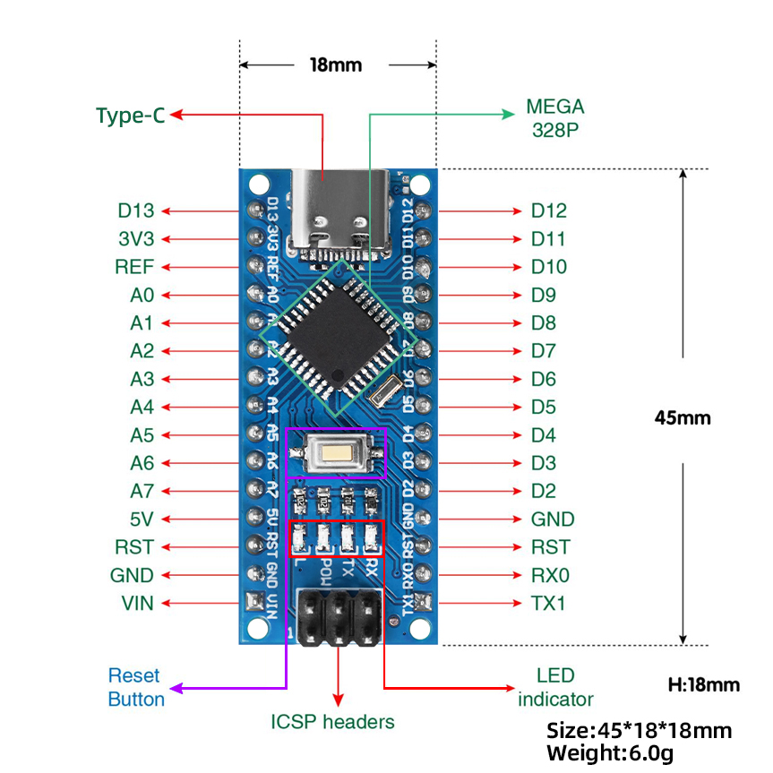

| 1    | ICSP Headers                 | 是一个AVR，一个由MOSI，MISO，SCK，RESET，VCC和GND组成的的微型编程头。它通常被称为SPI（串行外设接口），可以被认为是输出的“扩展”。 |
| ---- | ---------------------------- | :----------------------------------------------------------: |
| 2    | LED indicator  （RX）        |         控制板通过串口通信，接收到信息时，RX灯闪烁。         |
| 3    | LED indicator  （TX）        |          控制板通过串口通信，发送信息时，TX灯闪烁。          |
| 4    | LED indicator  （POW）       |             给控制板供电时，LED亮起，否则熄灭。              |
| 5    | LED indicator  （L）         |       当D13为高电平时，LED亮起，为低电平时，LED熄灭。        |
| 6    | RX0（D0）  TX1（D1）  D2-D13 | 有14个数字I/O引脚（D0-D13）（其中6个提供PWM（脉宽调制）输出），这些引脚可配置为数字输入引脚，用于读取逻辑值（0或1） ；或作为数字输出引脚来驱动不同的模块，如LED，继电器等。 |
| 7    | RST                          |             可外接按键，和ResetButton功能一样。              |
| 8    | MEGA 328P                    | 每个控制板板都有自己的微控制器。你可以假设它作为板的大脑。微控制器通常是ATMEL公司的。在从Arduino IDE加载新程序之前，你必须知道你的板上有什么IC。。这个控制板的微控制器是ATMEGA328P-AU。 |
| 9    | TYPE-C USB                   | 利用TYPE-C USB线连接到电脑USB端口，可以给控制板供电，还可以给控制板上传程序。 |
| 10   | 3V3                          |                    提供DC 3.3V 输出电压。                    |
| 11   | REF                          | 代表模拟参考。它有时用于设置外部参考电压（0至5伏之间）作为模拟输入引脚的上限。 |
| 12   | A0-A7                        |                       8个模拟引脚A0-A7                       |
| 13   | 5V                           |                     提供DC 5V 输出电压。                     |
| 14   | GND                          |                             GND                              |
| 15   | VIN                          |             外部输入DC 7-12V电压，给控制板供电。             |
| 16   | Reset  Button                |                           复位按键                           |

## 产品特殊接口

串口通信接口：RX0、TX1

PWM接口（脉宽调制）：D3 D5 D6 D9 D10 D11

外部中断接口：D2(中断0)和D3 (中断)

SPI通信接口：D10为SS、D11为MOSI、D12为MISO、D13为SCK

IIC通信端口：A4为SDA、A5为SCL

## 产品使用说明

### 下载安装Arduino IDE(WIN10/MAC)

拿到这个控制板后，我们首先需要下载安装Arduino IDE。

你可以进入以下网址下载Arduino IDE：https://www.arduino.cc/en/software/  进入到这里,根据自己电脑系统选择不同的下载软件

就可以下载最新的2.3.4版本IDE了.如果出现下面了这个界面，就选择 ，直到他开始下载就可以啦 ，如果没有的话请直接忽略.!


安装过程就很简单了，一直点我同意或者下一步就行了


注意，到了这一步的时候我们要记住安装路径，确保自己下次可以找到这个文件,确定没问题就点击安装。


到了这里Arduino IED已经下载安装好啦 。

###  下载USB芯片驱动

接下来就是下载CH340驱动了，，驱动提取链接: https://www.wch.cn/downloads/category/67.html

第一步我们选择和自己板子一样的芯片型号，第二步根据自己的电脑系统选择合适的驱动下载。

 

####  WINDOWS版本驱动

选择Windows版本的驱动点击进去后，我们选择下载，随后在右上角找到下载图标，打开下载的文件。


打开文件后我们点击安装就可以。

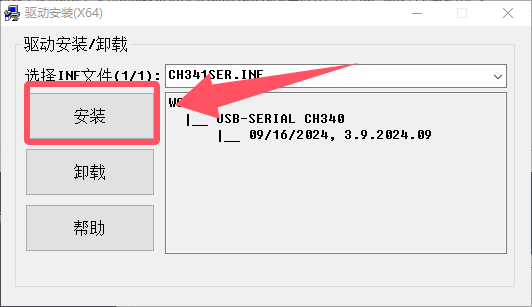

随后我们检查一下驱动安装是否成功，将控制板用USB线连接在电脑上后我们要寻找到设备管理器，在电脑桌面的左下角有个，点击之后我们找到此电脑，随后右击鼠标，是右击鼠标哦，选择更多，点击管理。

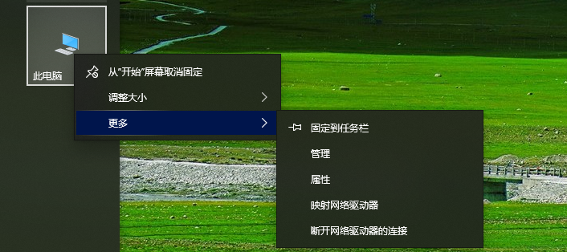

点击之后我们就可以找到设备管理器，


 下图的样子是安装失败的显示，需要重新安装或者换个接口试试，如果成功，请跳过这张。

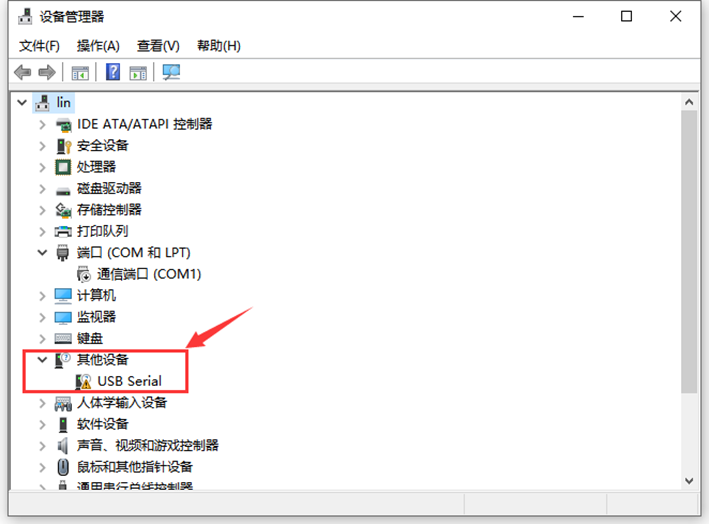

确保设备管理器中显示的端口如图所示就代表安装成功了


####  MAC版本驱动安装

选择适合MAC的软件下载，进去到其中后我们点击下载，随后在下载栏中找到自己的下载的软件。

打开安装包后我们就可以获得这三个文件，切记！！三个文件要放在一个文件夹里！！！随后我们点击后缀为PKG的文件进行安装。


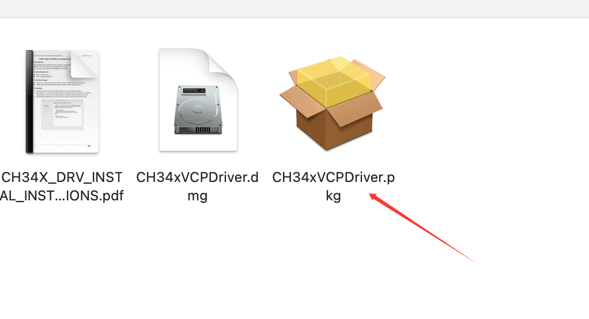

 

接下来还是一样的，继续，下一步，安装三部曲就好啦，不过还是要注意，安装的位置一定要清楚哦。


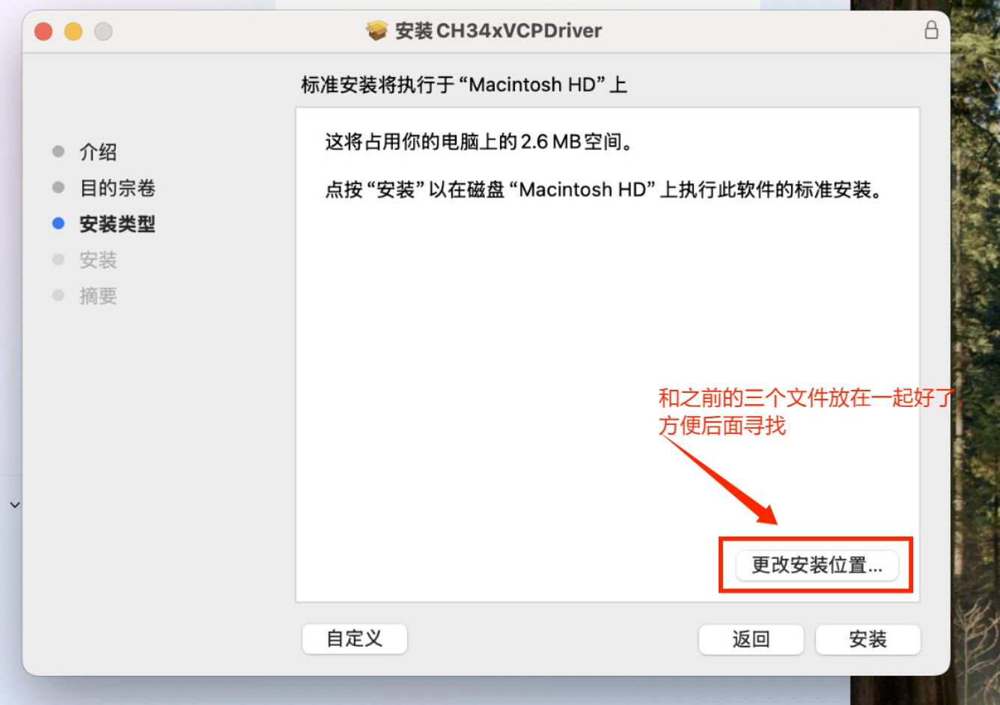

###   Arduino IDE代码烧入

首先我们点击图标，打开Arduino IDE，按照图片顺序依次选择我们的开发板和端口（一定要选择正确的开发板哦，不然是无法连接的！！)再点击确定。

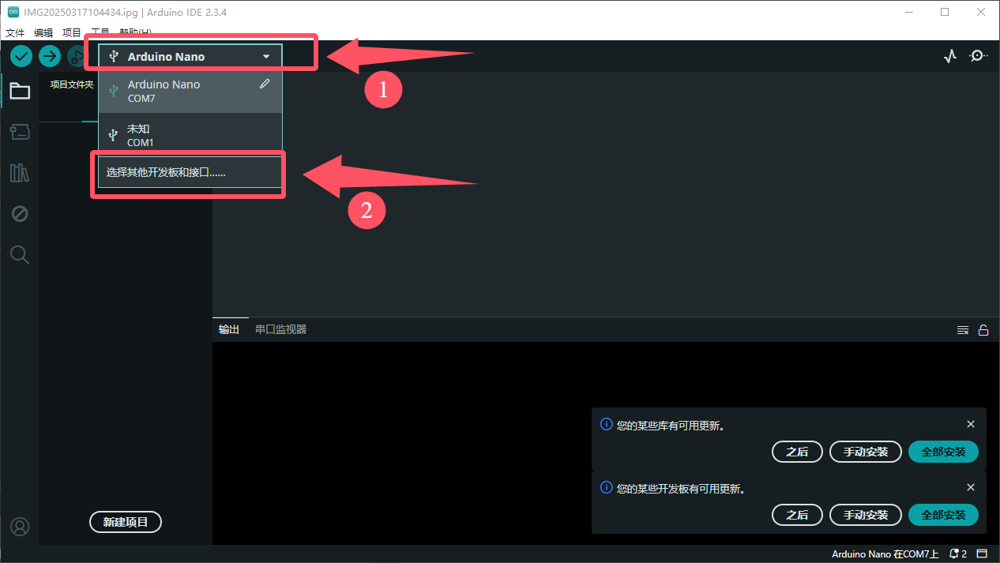

我们输入板子的名称关键字，选择我们对应的开发板，在选择对应的端口，点击确认

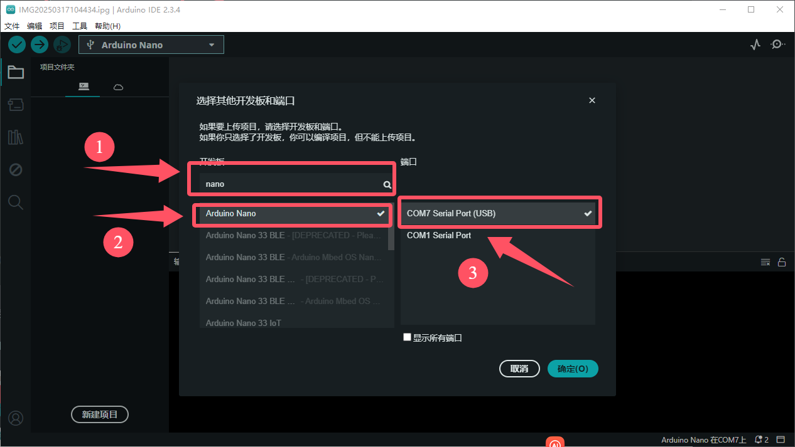

随后，我们就要开始创建项目啦,你可以选择Ctrl+N亦或者点击在左上角图标后找到新建项目，点击选择创建新项目,得到了这个界面

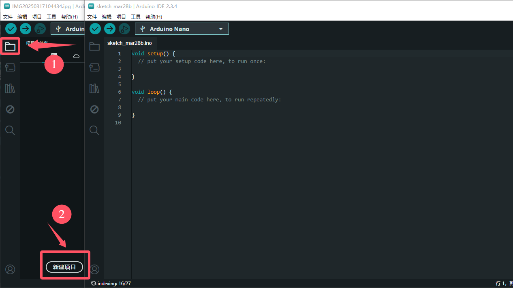

接下来就是代码烧入了，将以下代码复制粘贴到我们的界面里面，注意！！原来里面的东西要全部删除哦

```
int val;     //设置变量
int ledpin=13;  //设置led引脚为13

void setup()
{
  Serial.begin(9600);    //设置波特率
  pinMode(ledpin,OUTPUT);   //设置引脚模式
}

void loop()
{
  val=Serial.read();    //将串口赋值参数
  if(val=='R')          //进行串口参数条件判断
	{
	digitalWrite(ledpin,HIGH);    //灯亮
	delay(500);       			 //等待500毫秒
	digitalWrite(ledpin,LOW);     //灯灭
	delay(500);					//等待500毫秒
	Serial.println("Hello World!");   //串口输出Hello World!
	}
}

 
```

 随后我们就要开始编译和烧入程序啦，按照顺序点击，出现下面框选的东西（这是代表程序没有问题，要是没有出现下面输出框框内的东西要检查代码是否正确哦)，之后再次点击


随后我们就可以看看代码功能了，Ctrl+Shift+M或者点击上面的工具，我们选择串口监视窗口，检查一下代码波特率和软件波特率是否一致，随后在串口监视器内输入一个字母R，随后按Enter，就会弹出“Hello World”

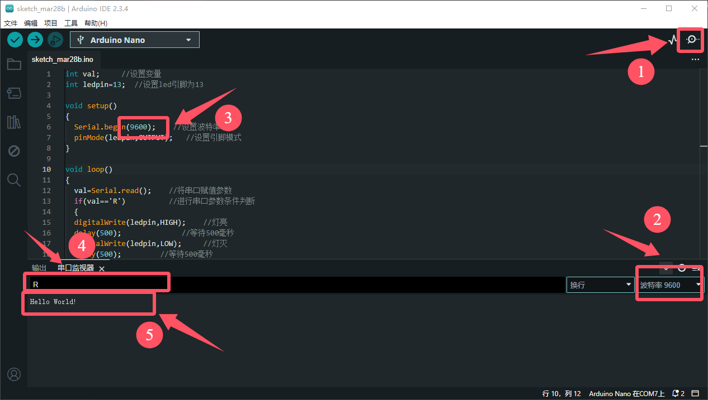

同时，我们的控制板灯也会闪烁一下,这样你就成功的踏入了程序员的旅程啦。

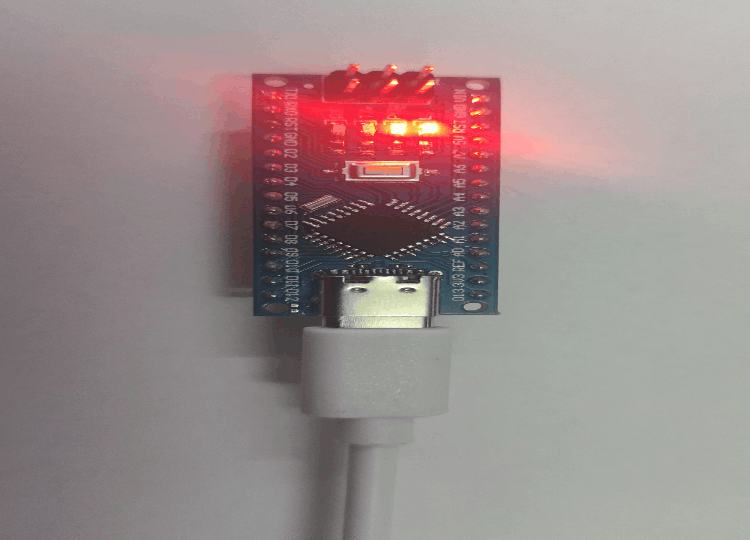


## 常见问题解决方法

### 串口无法连接：

1.需要检查驱动是否安装成功，重新安装CH340驱动.

2.需要看看type-c接口调换一下，或者电脑接口重新拔插一下，再或者换跟数据线试试.

### 产品代码烧入失败

1.检查开发板和端口是否选择正确，重新选择对应端口和开发板.

2.看看代码是否正确，将文本代码复制粘贴进去看看.

3.检查接口是否松动，将接口重新拔插.

4.关闭软件重新打开或者重启电脑.

## 产品重要芯片的规格书下载

 [ATMEGA328P数据手册.pdf](规格书\ATMEGA328P数据手册.pdf) 

 [CH340C数据手册.pdf](规格书\CH340C数据手册.pdf) 
