.. _MB1704-NANO-CH340:

MB1704 NANO CH340
=================

.. image:: ./media/1.1.jpeg

.. _1.-概述:

1. 概述
-------

NANO ch340的处理器核心是ATMEGA328P-AU。和官网的ARDUINO NANO对比， NANO
ch340使用的USB转串口芯片为CH340G，安装的驱动文件不一样，其他的使用方法完全一样。

它同时具有14路数字输入/输出口（其中6路可作为PWM输出），8路模拟输入，1个16MHz晶体振荡器，1个Type-c
USB口，1个ICSP接口和一个复位按钮。

其中ICSP接口是用来给ATMEGA328P-AU烧录固件，由于这个该芯片我们在出厂前都以烧录好固件，所以一般不用。使用时我们可以利用Type-c
USB线供电，，还可以利用排母接口Vin GND（DC 7-12V）供电。

.. _2.-规格参数:

2. 规格参数
-----------

#. 单片机：ATMEAG328P

#. 工作电压：5v

#. 输入电压（推荐）：DC 7- 12v

#. 数字I/0引脚：14 (DO-D13)

#. PWM数字I/0引脚：6 （D3 D5 D6 D9 D10 D11）

#. 模拟输入引脚：8（A0-A7）

#. 直流电流每I/0引脚：40 mA

#. Flash内存：32kb其中2kb由bootloadere使用

#. SRAM：2KB

#. KBEEPROM: 1KB

#. 时钟速度：16 MHz

#. LED_BUILTIN:D13

#. 工作温度：0℃-50℃

#. 开发板尺寸：18MM×45MM×18MM

#. 开发板重量：6.0G

#. 工作温度：0℃~50℃

.. _3.-产品接口说明:

3. 产品接口说明
---------------

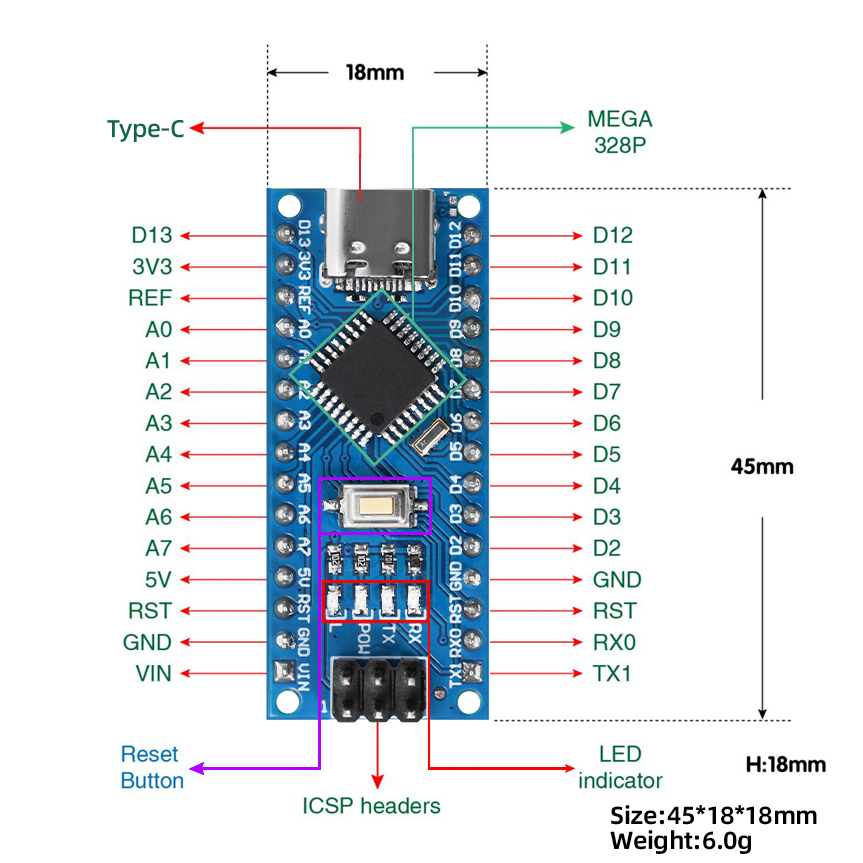

.. container:: table-wrapper

   +----+----------------------------+-------------------------------+
   | 1  | ICSP Headers               | 是一个AVR，一                 |
   |    |                            | 个由MOSI，MISO，SCK，RESET，V |
   |    |                            | CC和GND组成的的微型编程头。它 |
   |    |                            | 通常被称为SPI（串行外设接口） |
   |    |                            | ，可以被认为是输出的“扩展”。  |
   +====+============================+===============================+
   | 2  | LED indicator （RX）       | 控制板通过串口通              |
   |    |                            | 信，接收到信息时，RX灯闪烁。  |
   +----+----------------------------+-------------------------------+
   | 3  | LED indicator （TX）       | 控制板通过串口                |
   |    |                            | 通信，发送信息时，TX灯闪烁。  |
   +----+----------------------------+-------------------------------+
   | 4  | LED indicator （POW）      | 给控制                        |
   |    |                            | 板供电时，LED亮起，否则熄灭。 |
   +----+----------------------------+-------------------------------+
   | 5  | LED indicator （L）        | 当D13为高电平时，L            |
   |    |                            | ED亮起，为低电平时，LED熄灭。 |
   +----+----------------------------+-------------------------------+
   | 6  | RX0（D0） TX1（D1） D2-D13 | 有                            |
   |    |                            | 14个数字I/O引脚（D0-D13）（其 |
   |    |                            | 中6个提供PWM（脉宽调制）输出  |
   |    |                            | ），这些引脚可配置为数字输入  |
   |    |                            | 引脚，用于读取逻辑值（0或1）  |
   |    |                            | ；或作为数字输出引脚来驱动    |
   |    |                            | 不同的模块，如LED，继电器等。 |
   +----+----------------------------+-------------------------------+
   | 7  | RST                        | 可外接                        |
   |    |                            | 按键，和ResetButton功能一样。 |
   +----+----------------------------+-------------------------------+
   | 8  | MEGA 328P                  | 每个控制板板                  |
   |    |                            | 都有自己的微控制器。你可以假  |
   |    |                            | 设它作为板的大脑。微控制器通  |
   |    |                            | 常是ATMEL公司的。在从Arduino  |
   |    |                            | IDE加载新程序之前，你必须知道 |
   |    |                            | 你的板上有什么IC。。这个控制  |
   |    |                            | 板的微控制器是ATMEGA328P-AU。 |
   +----+----------------------------+-------------------------------+
   | 9  | TYPE-C USB                 | 利用TYPE-C                    |
   |    |                            | USB线连接                     |
   |    |                            | 到电脑USB端口，可以给控制板供 |
   |    |                            | 电，还可以给控制板上传程序。  |
   +----+----------------------------+-------------------------------+
   | 10 | 3V3                        | 提供DC 3.3V 输出电压。        |
   +----+----------------------------+-------------------------------+
   | 11 | REF                        | 代表模拟参考。它有时用        |
   |    |                            | 于设置外部参考电压（0至5伏之  |
   |    |                            | 间）作为模拟输入引脚的上限。  |
   +----+----------------------------+-------------------------------+
   | 12 | A0-A7                      | 8个模拟引脚A0-A7              |
   +----+----------------------------+-------------------------------+
   | 13 | 5V                         | 提供DC 5V 输出电压。          |
   +----+----------------------------+-------------------------------+
   | 14 | GND                        | GND                           |
   +----+----------------------------+-------------------------------+
   | 15 | VIN                        | 外部输入DC                    |
   |    |                            | 7-12V电压，给控制板供电。     |
   +----+----------------------------+-------------------------------+
   | 16 | Reset Button               | 复位按键                      |
   +----+----------------------------+-------------------------------+

.. _4.-产品特殊接口:

4. 产品特殊接口
---------------

串口通信接口：RX0、TX1

PWM接口（脉宽调制）：D3 D5 D6 D9 D10 D11

外部中断接口：D2(中断0)和D3 (中断)

SPI通信接口：D10为SS、D11为MOSI、D12为MISO、D13为SCK

IIC通信端口：A4为SDA、A5为SCL

.. _5.-产品使用说明:

5. 产品使用说明
---------------

.. _5.1-下载安装Arduino-IDE(WIN10/MAC):

5.1 下载安装Arduino IDE(WIN10/MAC)
~~~~~~~~~~~~~~~~~~~~~~~~~~~~~~~~~~

拿到这个控制板后，我们首先需要下载安装Arduino IDE。

你可以进入以下网址下载Arduino IDE：\ https://www.arduino.cc/en/software/
进入到这里,根据自己电脑系统选择不同的下载软件\ |image1|

就可以下载最新的2.3.4版本IDE了.如果出现下面了这个界面，就选择
|image2|\ ，直到他开始下载就可以啦 ，如果没有的话请直接忽略.!

.. image:: ./media/5.2.png

安装过程就很简单了，一直点我同意或者下一步就行了

.. image:: ./media/5.3.png

注意，到了这一步的时候我们要记住安装路径，确保自己下次可以找到这个文件,确定没问题就点击安装。

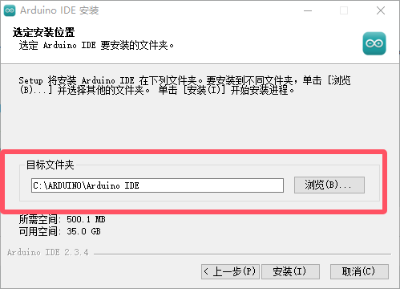

到了这里Arduino IED已经下载安装好啦 。

.. _5.2-下载USB芯片驱动:

5.2 下载USB芯片驱动
~~~~~~~~~~~~~~~~~~~

接下来就是下载CH340驱动了，，驱动提取链接:
https://www.wch.cn/downloads/category/67.html

第一步我们选择和自己板子一样的芯片型号，第二步根据自己的电脑系统选择合适的驱动下载。

.. image:: ./media/5.5.png

.. _1.-WINDOWS版本驱动:

1. WINDOWS版本驱动
^^^^^^^^^^^^^^^^^^

选择Windows版本的驱动点击进去后，我们选择下载，随后在右上角找到下载图标，打开下载的文件。

.. image:: ./media/5.6.png

打开文件后我们点击安装就可以。

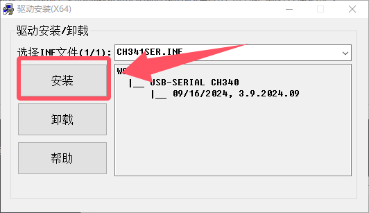

随后我们检查一下驱动安装是否成功，将控制板用USB线连接在电脑上后我们要寻找到设备管理器，在电脑桌面的左下角有个\ |image3|\ ，点击之后我们找到此电脑，随后右击鼠标，是右击鼠标哦，选择更多，点击管理。

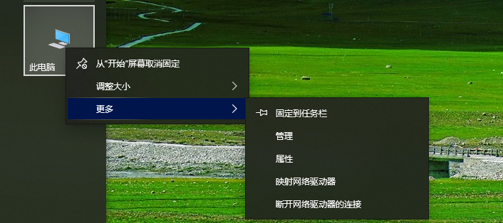

点击之后我们就可以找到设备管理器，

.. image:: ./media/5.9.png

下图的样子是安装失败的显示，需要重新安装或者换个接口试试，如果成功，请跳过这张。

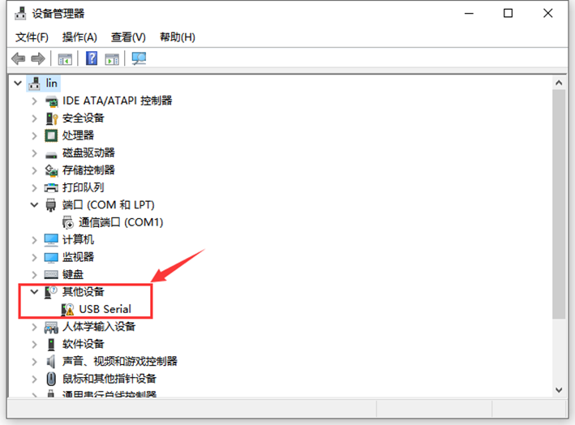

确保设备管理器中显示的端口如图所示就代表安装成功了

.. image:: ./media/5.11.png

.. _2.-MAC版本驱动安装:

2. MAC版本驱动安装
^^^^^^^^^^^^^^^^^^

选择适合MAC的软件下载，进去到其中后我们点击下载，随后在下载栏中找到自己的下载的软件。\ |image4|

打开安装包后我们就可以获得这三个文件，切记！！三个文件要放在一个文件夹里！！！随后我们点击后缀为PKG的文件进行安装。

.. image:: ./media/5.13.png

接下来还是一样的，继续，下一步，安装三部曲就好啦，不过还是要注意，安装的位置一定要清楚哦。

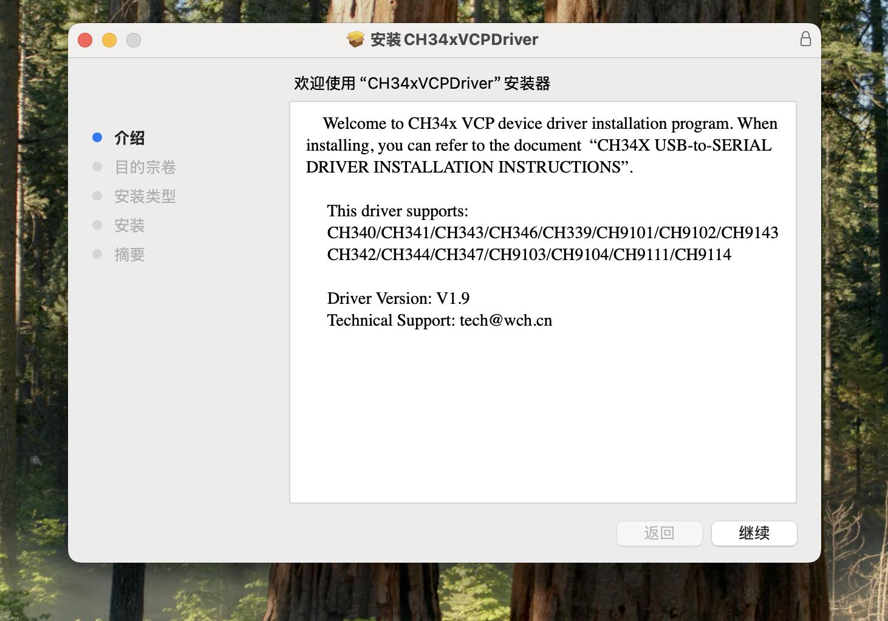

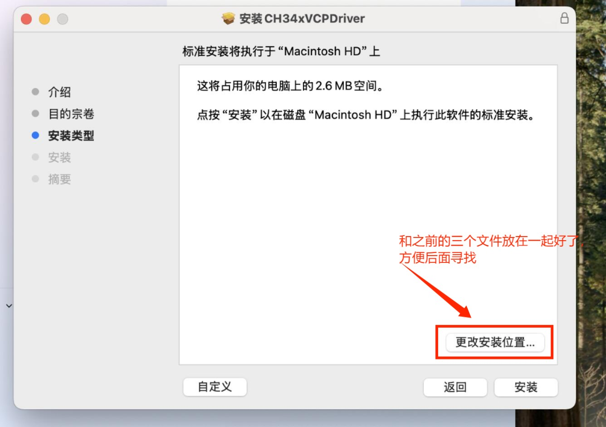

.. _5.3-Arduino-IDE代码烧入:

5.3 Arduino IDE代码烧入
~~~~~~~~~~~~~~~~~~~~~~~

首先我们点击\ |image5|\ 图标，打开Arduino
IDE，按照图片顺序依次选择我们的开发板和端口（一定要选择正确的开发板哦，不然是无法连接的！！)再点击确定。

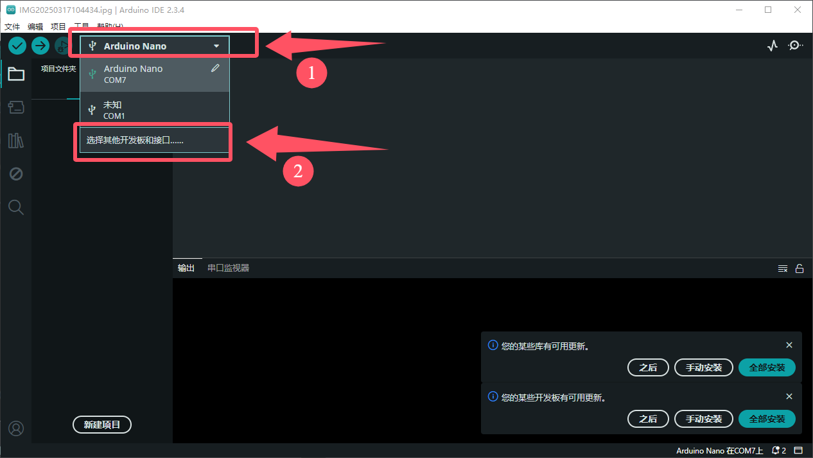

我们输入板子的名称关键字，选择我们对应的开发板，在选择对应的端口，点击确认

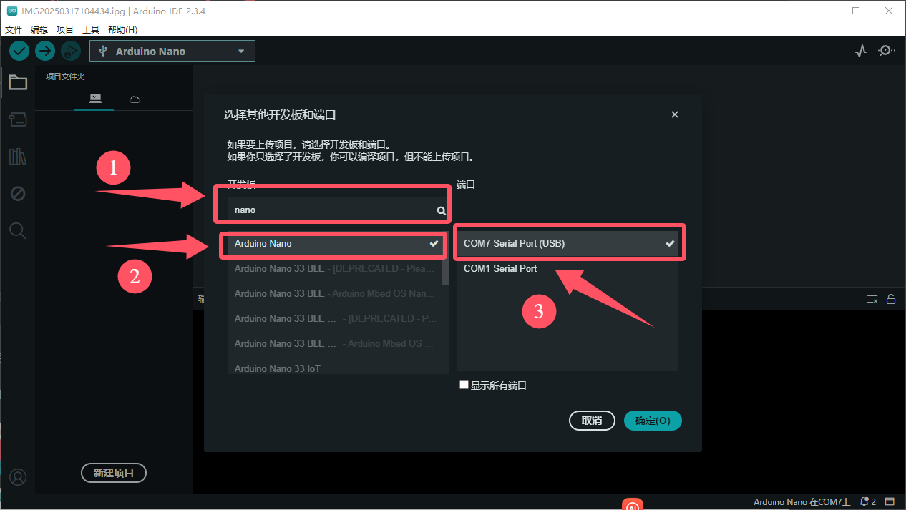

随后，我们就要开始创建项目啦,你可以选择Ctrl+N亦或者点击在左上角图标后找到新建项目，点击选择创建新项目,得到了这个界面

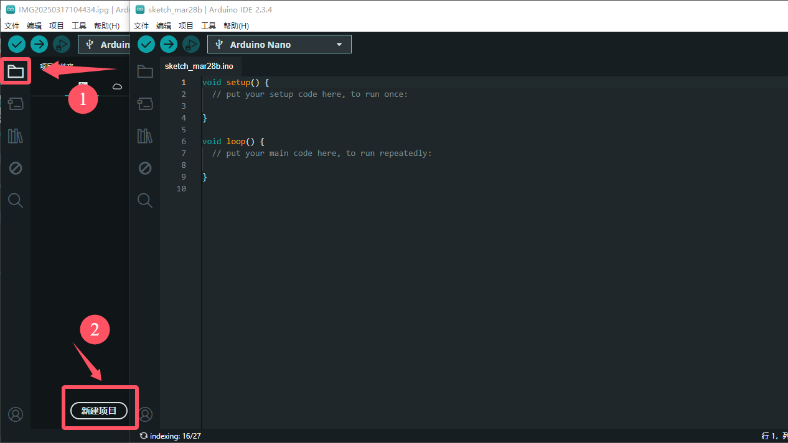

接下来就是代码烧入了，将以下代码复制粘贴到我们的界面里面，注意！！原来里面的东西要全部删除哦

::

   int val;     //设置变量
   int ledpin=13;  //设置led引脚为13

   void setup()
   {
     Serial.begin(9600);    //设置波特率
     pinMode(ledpin,OUTPUT);   //设置引脚模式
   }

   void loop()
   {
     val=Serial.read();    //将串口赋值参数
     if(val=='R')          //进行串口参数条件判断
       {
       digitalWrite(ledpin,HIGH);    //灯亮
       delay(500);                  //等待500毫秒
       digitalWrite(ledpin,LOW);     //灯灭
       delay(500);                 //等待500毫秒
       Serial.println("Hello World!");   //串口输出Hello World!
       }
   }

    

随后我们就要开始编译和烧入程序啦，按照顺序点击\ |image6|\ ，出现下面框选的东西（这是代表程序没有问题，要是没有出现下面输出框框内的东西要检查代码是否正确哦)，之后再次点击\ |image7|

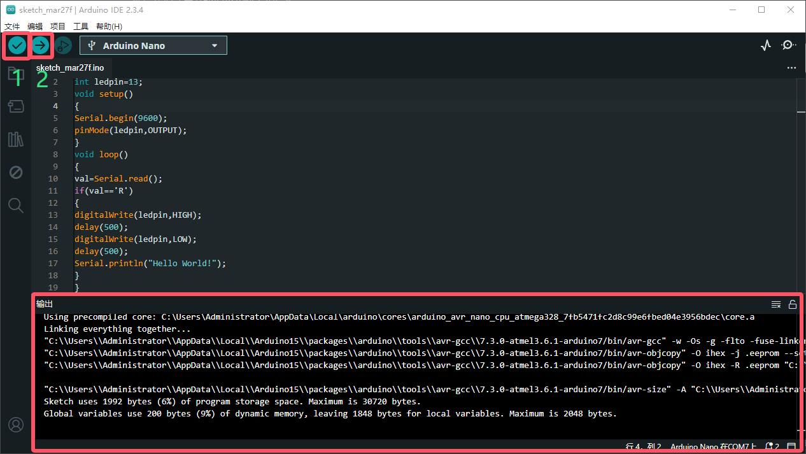

随后我们就可以看看代码功能了，Ctrl+Shift+M或者点击上面的工具，我们选择串口监视窗口，检查一下代码波特率和软件波特率是否一致，随后在串口监视器内输入一个字母R，随后按Enter，就会弹出“Hello
World”

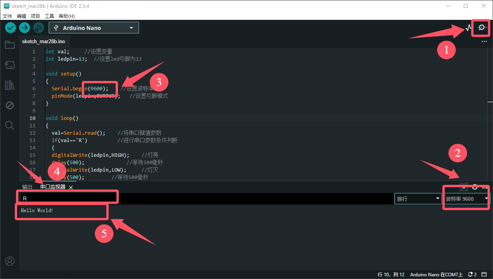

同时，我们的控制板灯也会闪烁一下,这样你就成功的踏入了程序员的旅程啦。

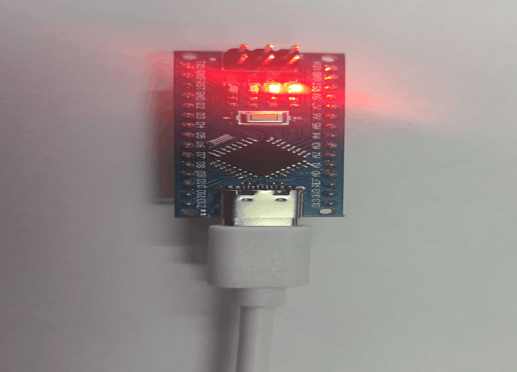

.. _6.-常见问题解决方法:

6. 常见问题解决方法
-------------------

.. _6.1-串口无法连接：:

6.1 串口无法连接：
~~~~~~~~~~~~~~~~~~

1.需要检查驱动是否安装成功，重新安装CH340驱动.

2.需要看看type-c接口调换一下，或者电脑接口重新拔插一下，再或者换跟数据线试试.

.. _6.2-产品代码烧入失败:

6.2 产品代码烧入失败
~~~~~~~~~~~~~~~~~~~~

1.检查开发板和端口是否选择正确，重新选择对应端口和开发板.

2.看看代码是否正确，将文本代码复制粘贴进去看看.

3.检查接口是否松动，将接口重新拔插.

4.关闭软件重新打开或者重启电脑.

.. _6.3-产品重要芯片的规格书下载:

6.3 产品重要芯片的规格书下载
----------------------------

`ATMEGA328P数据手册.pdf </api/attachment/ATMEGA328P%E6%95%B0%E6%8D%AE%E6%89%8B%E5%86%8C.7z?repo=__root__C:\&path=%2FUsers%2FAdministrator%2FDesktop%2F%E4%B8%8A%E4%BC%A0MB0174%2FMB0174%2Fdocs%2FATMEGA328P%E6%95%B0%E6%8D%AE%E6%89%8B%E5%86%8C.7z>`__

`CH340C数据手册.pdf </api/attachment/CH340C%E6%95%B0%E6%8D%AE%E6%89%8B%E5%86%8C.7z?repo=__root__C:\&path=%2FUsers%2FAdministrator%2FDesktop%2F%E4%B8%8A%E4%BC%A0MB0174%2FMB0174%2Fdocs%2FCH340C%E6%95%B0%E6%8D%AE%E6%89%8B%E5%86%8C.7z>`__

.. |image1| image:: ./media/5.1.png
.. |image2| image:: ./media/5.1.1.png
.. |image3| image:: ./media/5.3.2.png
.. |image4| image:: ./media/5.12.png
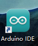

